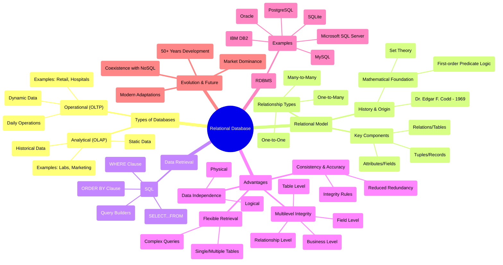

# Diagrams for Chapter 1

Add your ER diagrams, conceptual diagrams, or other illustrations here.

# Chapter 1: The Relational Database - Mind Map

## Diagram Explanation

This mind map provides a visual representation of the key concepts covered in Chapter 1. The central node represents the Relational Database, with major branches extending to cover:

1. **Types of Databases**: Distinguishes between Operational (OLTP) and Analytical (OLAP) databases
2. **Relational Model**: Shows the historical context, mathematical foundations, and key components
3. **Data Retrieval**: Illustrates SQL and its components
4. **Advantages**: Details the four main advantages of relational databases
5. **RDBMS**: Lists major relational database management systems
6. **Evolution & Future**: Highlights the model's longevity and adaptability

The mind map uses a hierarchical structure to show relationships between concepts, making it easier to understand how different aspects of relational databases are connected.
