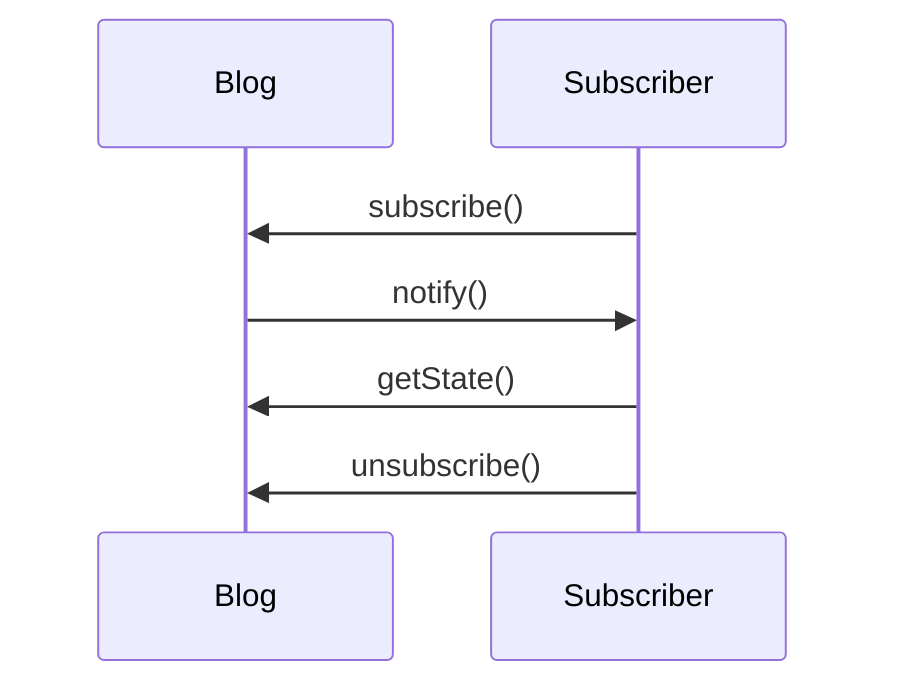

# 👀 Observer Pattern – Event Subscription

## ✅ Definition
Observer is a behavioral design pattern that lets an object (the "publisher" or "subject") notify multiple other objects ("subscribers" or "observers") about changes in its state or events, without knowing who those subscribers are.

---

## 🧩 Problem
Suppose you have two objects:
- **Customer**: wants to buy a new iPhone.
- **Store**: will soon have iPhones in stock.

Inefficient approaches:
- Customer checks the store every day (wasteful polling).
- Store emails all customers every time (spamming uninterested people).

**Need:** Only interested customers should get notified when iPhones are available.

---

## ✅ Solution
- **Publisher (Subject):** The object whose state changes and needs to notify others.
- **Subscriber (Observer):** Objects that want to be notified.

Mechanism:
- Subscribers register (subscribe) with the publisher.
- When an event occurs, the publisher calls `update()` on each subscriber.
- Publisher only knows the observer interface, not concrete subscribers.

---

## 🗞️ Real-World Analogy
You subscribe to a magazine. When a new issue is published, the publisher sends it to you. If you unsubscribe, you stop receiving it.

---

## ⚙️ Structure

```
+----------------+          +------------------+
|   Publisher    | -------> |   IObserver      |
+----------------+          +------------------+
        |                        ↑        ↑
        |                        |        |
        v                        |        |
+---------------+        +----------------+
| ConcreteSub1  |        | ConcreteSub2   |
+---------------+        +----------------+
```

- **Publisher:** Maintains a list of subscribers, supports `subscribe()`, `unsubscribe()`, `notify()`.
- **Observer interface:** Declares `update(data)`.
- **ConcreteSubscriber:** Implements `update()` with specific behavior.
- **Client:** Creates publisher and subscribers, links them.

---

## 🧪 Example – Blog & Subscriber

**UML Sequence Diagram:**


**Python Pseudocode:**
```python
class Blog:
    def __init__(self):
        self.subscribers = []
        self.state = None

    def subscribe(self, subscriber):
        self.subscribers.append(subscriber)

    def unsubscribe(self, subscriber):
        self.subscribers.remove(subscriber)

    def notify(self):
        for sub in self.subscribers:
            sub.update(self)

    def publish(self, post):
        self.state = post
        self.notify()

class Subscriber:
    def update(self, blog):
        print(f"New post: {blog.state}")

blog = Blog()
sub1 = Subscriber()
sub2 = Subscriber()
blog.subscribe(sub1)
blog.subscribe(sub2)
blog.publish("Observer Pattern in Depth")
```

---

## 🎯 Applicability
Use Observer when:
- An object needs to notify multiple others about changes.
- The list of subscribers may change at runtime.
- You want to reduce coupling between components.

---

## ⚖️ Pros & Cons
| Pros                                         | Cons                                      |
|-----------------------------------------------|-------------------------------------------|
| ✅ Open/Closed: Add new subscribers easily    | ❌ Notification order is not guaranteed    |
| ✅ Dynamic relationships between objects      | ❌ Many subscribers can affect performance |
| ✅ Easy to extend event-driven systems        | ❌ Risk of memory leaks if not unsubscribed|

---

## 🔁 Observer vs Mediator
| Observer           | Mediator                                 |
|--------------------|------------------------------------------|
| Notifies many      | Coordinates complex interactions         |
| One-way (Publisher → Subscriber) | Two-way (Component ↔ Mediator ↔ Component) |
| Subscribers register/unregister  | Components send events to mediator         |
| Example: Event system, UI events | Example: Dialog UI coordination           |

---

## 🛠️ How to Implement
1. **Split your logic:** Identify the core (publisher) and the dependent parts (subscribers).
2. **Declare the observer interface:** At minimum, declare an `update()` method.
3. **Declare the publisher interface:** Add methods to add/remove subscribers. Publisher should only interact with subscribers via the interface.
4. **Implement subscription logic:** Usually in an abstract publisher class, or via composition.
5. **Create concrete publishers:** Notify all subscribers when something important happens.
6. **Implement concrete subscribers:** Implement `update()` to react to notifications. Optionally, fetch more data from the publisher.
7. **Client setup:** Create subscribers and register them with publishers.

---

## 🔁 Relations with Other Patterns
- **Chain of Responsibility, Command, Mediator, and Observer** all address different ways of connecting senders and receivers:
  - **Chain of Responsibility:** Passes a request sequentially along a dynamic chain of potential receivers until one handles it.
  - **Command:** Establishes unidirectional connections between senders and receivers via command objects.
  - **Mediator:** Eliminates direct connections between senders and receivers, forcing all communication through a mediator object.
  - **Observer:** Lets receivers dynamically subscribe to and unsubscribe from notifications/events from senders.

- **Mediator vs. Observer:**
  - The difference can be subtle. Both can decouple components, and sometimes both patterns are used together.
  - **Mediator**: Centralizes all communication and coordination logic in one object. Components depend on the mediator, not on each other.
  - **Observer**: Establishes dynamic, one-way connections (publish/subscribe) between objects. Subscribers can come and go at runtime.
  - Sometimes, a Mediator can act as a publisher (using Observer internally), with components subscribing to its events. In this case, the patterns may look similar, but the intent is different: Mediator centralizes logic, Observer distributes it.
  - If all components become publishers, you have a distributed Observer system, not a Mediator.

- **Summary:**
  - Use **Mediator** to centralize and coordinate complex interactions.
  - Use **Observer** for dynamic, event-driven notification chains.
  - Use **Chain of Responsibility** for sequential, chain-based request handling.
  - Use **Command** to encapsulate actions and decouple senders from receivers.

---
