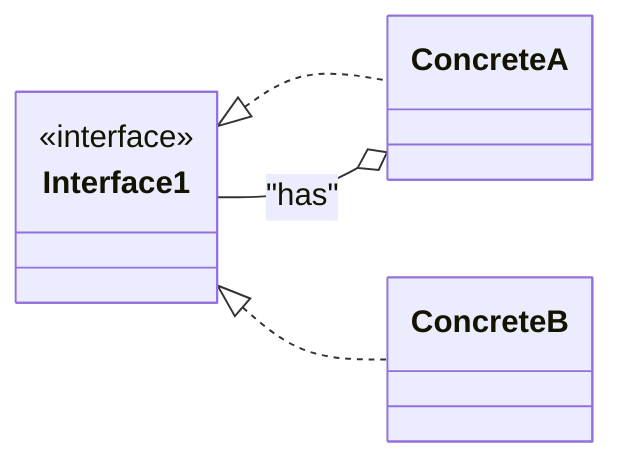

# 🏛️ Composing Objects Principle (Favor Composition Over Inheritance)

## ✅ Definition
The Composing Objects Principle states that **classes should achieve code reuse and flexibility through composition (aggregation and delegation) rather than inheritance**.

---

## 🧩 The Problem with Inheritance
- Inheritance tightly couples subclasses to their superclasses.
- Subclasses inherit all accessible attributes and methods, leading to deep, rigid dependency chains.
- Changes in a superclass can have wide, unintended effects on all subclasses.
- Inheritance defines behavior at compile time—cannot change at runtime.

---

## ✅ The Solution: Composition & Delegation
- **Composition**: Build complex objects by combining simpler objects (components) that each handle part of the behavior.
- **Delegation**: An object delegates work to another object, rather than inheriting its behavior.
- **Aggregation**: Objects are composed of other objects, which can be replaced or changed independently.
- Design patterns like **Composite** and **Decorator** use this principle.

---

## 🖼️ How Composition Works (UML Example)

- An instance of `ConcreteA` can be composed of any class that implements `Interface1`, including itself.
- This allows for flexible, interchangeable components.

---

## 🚀 Key Advantages
- **Code reuse without tight coupling**: Share behavior by composing objects, not inheriting.
- **Dynamic behavior at runtime**: Objects can add or change behaviors by swapping components.
- **More flexibility**: System can evolve without restructuring inheritance trees.

---

## ⚠️ Disadvantages
- **Code Duplication**: You must provide implementations for all behavior without the benefit of inheritance to share code. This can lead to similar implementations across classes.
- **More Boilerplate**: Each class must provide its own implementation for shared behaviors.
- **Design Complexity**: Requires careful design to manage object relationships and delegation.

---

## 💡 Summary
> The Composing Objects Principle:
> - Provides a means of code reuse without the tight coupling of inheritance
> - Allows objects to dynamically add behaviors at runtime
> - Provides your system with more flexibility
>
> Favoring composition over inheritance leads to more flexible, maintainable, and loosely coupled systems. Use composition to build up behavior dynamically and reduce the risks of deep inheritance hierarchies. However, both composition and inheritance have their place—choose based on your system’s needs.
