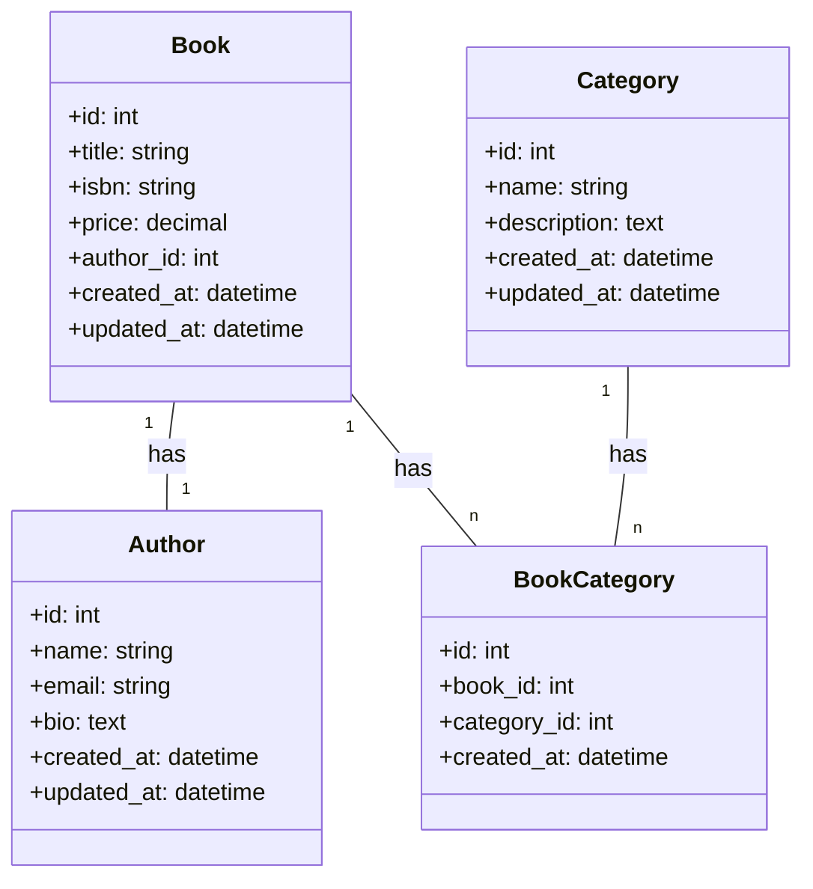

# Database Design Documentation

## Entity Relationship Diagram (ERD)



## Entity Descriptions

### 1. Book Entity
- **Purpose**: Represents a book in the system
- **Key Attributes**:
  - Title: The name of the book
  - ISBN: Unique identifier for the book
  - Price: Cost of the book
- **Relationships**:
  - Has one Author (1:1)
  - Belongs to many Categories (N:M)

### 2. Author Entity
- **Purpose**: Represents the author of books
- **Key Attributes**:
  - Name: Author's full name
  - Email: Contact email (unique)
  - Bio: Author's biography
- **Relationships**:
  - Can write many Books (1:N)

### 3. Category Entity
- **Purpose**: Represents book categories/genres
- **Key Attributes**:
  - Name: Category name
  - Description: Category description
- **Relationships**:
  - Can contain many Books (N:M)

## Relationship Types

### 1. One-to-One (1:1)
- **Book to Author**
  - Each book has exactly one author
  - Each author can write multiple books
  - This is a one-to-many relationship in practice, but we're modeling it as one-to-one for simplicity

### 2. Many-to-Many (N:M)
- **Book to Category**
  - A book can belong to multiple categories
  - A category can contain multiple books
  - Requires a junction table (BookCategory) to implement

## Design Considerations

### 1. Data Integrity
- ISBN must be unique
- Author email must be unique
- Category names should be unique
- All required fields must be non-null

### 2. Performance
- Indexes on frequently queried fields
- Optimized for read operations
- Efficient relationship queries

### 3. Scalability
- Simple structure for easy maintenance
- Flexible for future extensions
- Efficient for large datasets

### 4. Security
- Sensitive data protection
- Access control considerations
- Data validation rules

## Future Considerations

### 1. Potential Extensions
- User reviews and ratings
- Inventory management
- Order processing
- Publisher information

### 2. Performance Optimizations
- Caching strategies
- Query optimization
- Index management

### 3. Data Management
- Backup strategies
- Data archiving
- Audit logging

## Database Schema

### Book Table
| Column           | Type         | Constraints        | Description                    |
|------------------|--------------|-------------------|--------------------------------|
| id              | INT          | PRIMARY KEY      | Unique identifier              |
| title           | VARCHAR(200) | NOT NULL         | Book title                     |
| isbn            | VARCHAR(13)  | UNIQUE, NOT NULL | International Standard Book Number |
| price           | DECIMAL(10,2)| NOT NULL         | Book price                     |
| author_id       | INT          | FOREIGN KEY      | Reference to Author table      |
| created_at      | TIMESTAMP    | NOT NULL         | Record creation timestamp      |
| updated_at      | TIMESTAMP    | NOT NULL         | Record update timestamp        |

### Author Table
| Column      | Type         | Constraints   | Description                    |
|-------------|--------------|---------------|--------------------------------|
| id          | INT          | PRIMARY KEY   | Unique identifier              |
| name        | VARCHAR(200) | NOT NULL      | Author name                    |
| email       | VARCHAR(254) | UNIQUE        | Author email                   |
| bio         | TEXT         | NULL          | Author biography               |
| created_at  | TIMESTAMP    | NOT NULL      | Record creation timestamp      |
| updated_at  | TIMESTAMP    | NOT NULL      | Record update timestamp        |

### Category Table
| Column       | Type         | Constraints   | Description                    |
|--------------|--------------|---------------|--------------------------------|
| id           | INT          | PRIMARY KEY   | Unique identifier              |
| name         | VARCHAR(100) | NOT NULL      | Category name                  |
| description  | TEXT         | NULL          | Category description           |
| created_at   | TIMESTAMP    | NOT NULL      | Record creation timestamp      |
| updated_at   | TIMESTAMP    | NOT NULL      | Record update timestamp        |

### BookCategory Table (Junction Table)
| Column       | Type         | Constraints   | Description                    |
|--------------|--------------|---------------|--------------------------------|
| id           | INT          | PRIMARY KEY   | Unique identifier              |
| book_id      | INT          | FOREIGN KEY   | Reference to Book table        |
| category_id  | INT          | FOREIGN KEY   | Reference to Category table    |
| created_at   | TIMESTAMP    | NOT NULL      | Record creation timestamp      |

## Indexes

### Primary Indexes
- Book: id
- Author: id
- Category: id
- BookCategory: (book_id, category_id)

### Secondary Indexes
- Book: isbn
- Author: email
- Category: name

## Constraints

### Unique Constraints
- Book.isbn
- Author.email
- Category.name
- BookCategory(book_id, category_id)

### Foreign Key Constraints
- Book.author_id → Author.id
- BookCategory.book_id → Book.id
- BookCategory.category_id → Category.id

## Data Types and Sizes

### String Fields
- Book.title: VARCHAR(200)
- Book.isbn: VARCHAR(13)
- Author.name: VARCHAR(200)
- Author.email: VARCHAR(254)
- Category.name: VARCHAR(100)

### Text Fields
- Author.bio: TEXT
- Category.description: TEXT

### Numeric Fields
- Book.price: DECIMAL(10,2)

### Date/Time Fields
- created_at: TIMESTAMP
- updated_at: TIMESTAMP

## Implementation Approaches

### 1. Automatic Junction Table (Default)

```python
# models.py
from django.db import models

class Book(models.Model):
    title = models.CharField(max_length=200)
    isbn = models.CharField(max_length=13, unique=True)
    price = models.DecimalField(max_digits=10, decimal_places=2)
    author = models.ForeignKey(Author, on_delete=models.CASCADE)
    categories = models.ManyToManyField(Category)  # Automatic junction table
    created_at = models.DateTimeField(auto_now_add=True)
    updated_at = models.DateTimeField(auto_now=True)

# Example Queries
# Get all categories for a book
book = Book.objects.get(id=1)
categories = book.categories.all()

# Get all books in a category
category = Category.objects.get(id=1)
books = category.book_set.all()

# Add a category to a book
book.categories.add(category)

# Remove a category from a book
book.categories.remove(category)
```

### 2. Explicit Junction Table (Using `through`)

```python
# models.py
from django.db import models

class BookCategory(models.Model):
    book = models.ForeignKey(Book, on_delete=models.CASCADE)
    category = models.ForeignKey(Category, on_delete=models.CASCADE)
    created_at = models.DateTimeField(auto_now_add=True)

    class Meta:
        unique_together = ('book', 'category')
        ordering = ['-created_at']

class Book(models.Model):
    title = models.CharField(max_length=200)
    isbn = models.CharField(max_length=13, unique=True)
    price = models.DecimalField(max_digits=10, decimal_places=2)
    author = models.ForeignKey(Author, on_delete=models.CASCADE)
    categories = models.ManyToManyField(Category, through='BookCategory')
    created_at = models.DateTimeField(auto_now_add=True)
    updated_at = models.DateTimeField(auto_now=True)

# Example Queries
# Get all categories for a book with creation date
book = Book.objects.get(id=1)
book_categories = BookCategory.objects.filter(book=book).select_related('category')

# Get all books in a category with creation date
category = Category.objects.get(id=1)
category_books = BookCategory.objects.filter(category=category).select_related('book')

# Add a category to a book
BookCategory.objects.create(book=book, category=category)

# Remove a category from a book
BookCategory.objects.filter(book=book, category=category).delete()
```

## Relationship Implementation Details

### 1. One-to-One (Book to Author)
- Implemented using `ForeignKey` with `unique=True`
- Each book has exactly one author
- Each author can write multiple books
- Cascade deletion (if author is deleted, their books are deleted)

### 2. Many-to-Many (Book to Category)
- Implemented using explicit junction table (`BookCategory`)
- Allows tracking when relationships are created
- Provides additional metadata about the relationship
- Enforces unique combinations of book and category

## Common Queries

### 1. Basic Queries
```python
# Get all books with their authors
books = Book.objects.select_related('author').all()

# Get all books with their categories
books = Book.objects.prefetch_related('categories').all()

# Get books by category
books = Book.objects.filter(categories__name='Fiction')

# Get categories for a book
categories = book.categories.all()
```

### 2. Advanced Queries
```python
# Get books with their authors and categories
books = Book.objects.select_related('author').prefetch_related('categories').all()

# Get books with category creation dates
book_categories = BookCategory.objects.select_related('book', 'category').all()

# Get books by multiple categories
books = Book.objects.filter(categories__name__in=['Fiction', 'Mystery']).distinct()

# Get books with their category counts
from django.db.models import Count
books = Book.objects.annotate(category_count=Count('categories'))
```

### 3. Aggregation Queries
```python
# Get category statistics
from django.db.models import Count, Avg
category_stats = Category.objects.annotate(
    book_count=Count('book'),
    avg_price=Avg('book__price')
)

# Get author statistics
author_stats = Author.objects.annotate(
    book_count=Count('book'),
    total_value=Sum('book__price')
)
```

## Performance Considerations

### 1. Indexing
- Primary indexes on all `id` fields
- Foreign key indexes on `book_id` and `category_id`
- Composite index on `(book_id, category_id)` for the junction table

### 2. Query Optimization
- Use `select_related()` for ForeignKey relationships
- Use `prefetch_related()` for ManyToMany relationships
- Use `annotate()` for aggregated data
- Use `values()` or `values_list()` for specific fields

### 3. Caching Strategies
- Cache frequently accessed categories
- Cache book-category relationships
- Use Django's cache framework for query results

## Migration Strategy

### 1. Initial Migration
```bash
python manage.py makemigrations
python manage.py migrate
```

### 2. Adding New Fields
```python
# Add new field to BookCategory
class BookCategory(models.Model):
    # ... existing fields ...
    is_featured = models.BooleanField(default=False)
```

### 3. Data Migration
```python
# migrations/0002_add_featured_categories.py
from django.db import migrations

def set_featured_categories(apps, schema_editor):
    BookCategory = apps.get_model('books', 'BookCategory')
    # Set featured categories based on some criteria
    BookCategory.objects.filter(book__price__gt=50).update(is_featured=True)

class Migration(migrations.Migration):
    dependencies = [
        ('books', '0001_initial'),
    ]
    operations = [
        migrations.RunPython(set_featured_categories),
    ]
```
