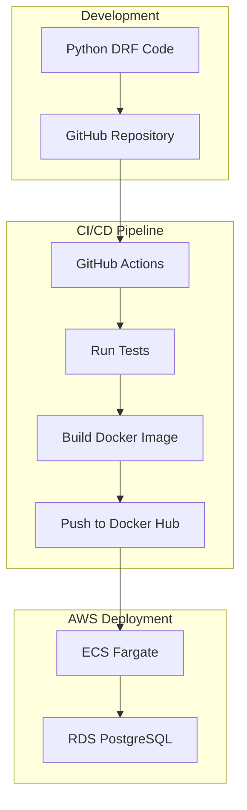
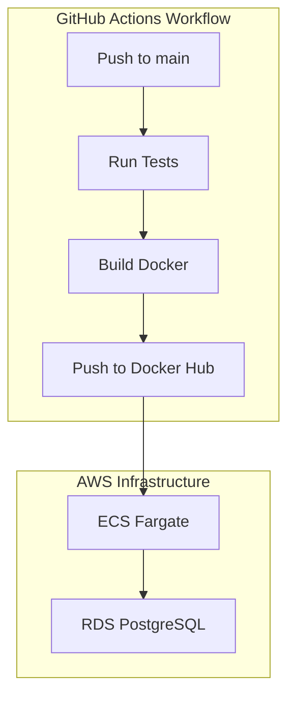

# High Level Architecture Documentation

## System Overview

## Architecture Components

### 1. Development Environment
- **Python DRF Application**
  - Django REST Framework (DRF)
  - PostgreSQL database (PostgreSQL)
  - Docker containerization (Docker)

- **GitHub Repository**
  - Source code management
  - Version control
  - Branch protection rules

### 2. CI/CD Pipeline (GitHub Actions)

#### Workflow Steps
1. **Test**
   - Run unit tests (pytest)
   - Code quality checks (ruff)
   - Run integration tests (if possible)

2. **Build**
   - Build Docker image (docker build)
   - Tag image with version (latest - version number)
   - Security scanning (clair)

3. **Deploy**
   - Push to Docker Hub (docker push)
   - Deploy to AWS ECS (ecs-cli)
   - Database migrations (rds-cli)

### 3. AWS Infrastructure

#### ECS Fargate
- **Container Management**
  - Serverless containers (Fargate)
  - Auto-scaling (ECS)
  - Load balancing (ALB)

#### RDS PostgreSQL
- **Database**
  - Managed PostgreSQL (RDS)
  - Automated backups (RDS)
  - High availability (RDS)

## Deployment Architecture

## Security Considerations

### 1. GitHub Security
- Repository secrets for sensitive data (GITHUB_TOKEN)
- Branch protection rules (main branch protection)
- Code review requirements (PR reviews)

### 2. Docker Security
- Docker image scanning (clair)
- Base image security (alpine)
- Container best practices (dockerfile)

### 3. AWS Security
- IAM roles and policies (IAM)
- Security groups (VPC)
- VPC configuration (VPC)

## Monitoring

### 1. Application Monitoring
- Container health checks (ECS)
- Application logs (ECS)
- Error tracking (ECS)

### 2. Infrastructure Monitoring
- ECS service metrics (ECS)
- RDS performance metrics (RDS)
- Cost monitoring (AWS)

## Cost Optimization

### 1. AWS Resources
- Right-sized ECS tasks (ECS)
- RDS instance optimization (RDS)
- Auto-scaling configuration (ECS)

### 2. Docker Optimization
- Multi-stage builds (dockerfile)
- Image size optimization (dockerfile)
- Layer caching (dockerfile)
