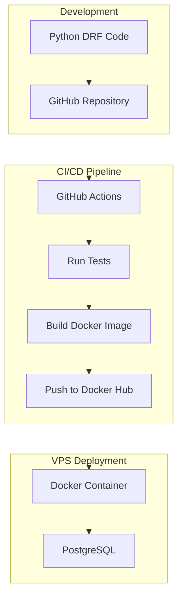
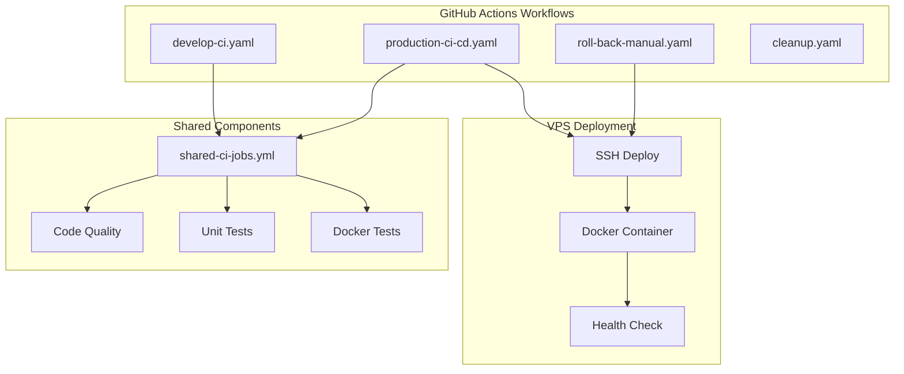

# High Level Architecture Documentation

## System Overview

## Architecture Components

### 1. Development Environment
- **Python DRF Application**
  - Django REST Framework (DRF)
  - PostgreSQL database
  - Docker containerization

- **GitHub Repository**
  - Source code management
  - Version control
  - Branch protection rules (main and develop)
  - Automated cleanup of merged branches

### 2. CI/CD Pipeline (GitHub Actions)

#### Workflow Steps
1. **Test & Quality**
   - Lint code (Ruff, Black)
   - Run unit tests (pytest)
   - Code coverage reporting
   - PostgreSQL service for tests

2. **Build**
   - Build Docker image
   - Tag images (latest + commit SHA)
   - Multi-stage builds for optimization

3. **Deploy**
   - Push to Docker Hub
   - SSH deployment to VPS
   - Container management
   - Health checks

### 3. VPS Infrastructure

#### Docker Container
- **Container Management**
  - Single container deployment
  - Volume mounting for persistence
  - Port mapping (8000:8000)
  - Automatic restart policy

#### PostgreSQL Database
- **Database**
  - Local PostgreSQL instance
  - Volume-mounted data
  - Regular backups (recommended)

## Deployment Architecture

## Security Considerations

### 1. GitHub Security
- Repository secrets for sensitive data
  - `VPS_HOST`
  - `VPS_USERNAME`
  - `VPS_SSH_KEY`
  - `DOCKER_USERNAME`
  - `DOCKER_PASSWORD`
- Branch protection rules
- Required PR reviews

### 2. Docker Security
- Multi-stage builds
- Base image security
- Container best practices
- Image pruning after deployment

### 3. VPS Security
- SSH key authentication
- Firewall configuration
- Regular system updates
- Limited port exposure

## Monitoring

### 1. Application Monitoring
- Container health checks
- Application logs
- Error tracking
- HTTP endpoint monitoring

### 2. Infrastructure Monitoring
- Docker container status
- PostgreSQL performance
- Disk usage monitoring
- Network monitoring

## Cost Optimization

### 1. VPS Resources
- Right-sized VPS instance
- Optimized container resources
- Storage management

### 2. Docker Optimization
- Multi-stage builds
- Image size optimization
- Layer caching
- Regular cleanup of unused images
